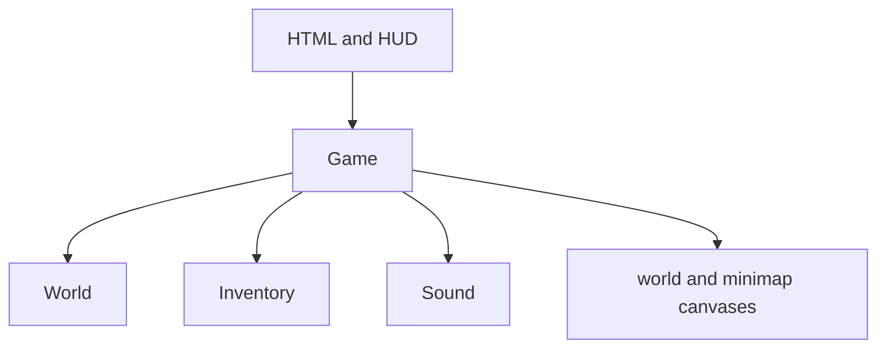

# architecture

This document describes the current browser implementation of **city of nothing**. The project is intentionally dependency-free: the browser loads one stylesheet and one script, then the script owns simulation, UI updates, persistence, audio, and canvas rendering.

## runtime composition



| Component | Responsibility |
| --- | --- |
| `Game` | Runtime state, input, animation loop, movement, collisions, infected and survivor AI, combat, conversations, recruitment, saves, HUD updates, and all drawing |
| `World` | Deterministic districts, roads, blocks, buildings, trees, interiors, sewer geometry/access, generated furniture, containers, and loot-table selection |
| `Inventory` | Item ownership, equipment, ammunition, armor totals, consuming items, filtering, and inventory markup |
| `Sound` | Lazily created Web Audio context and synthesized one-shot tones |

The final lines of `game.js` construct one `Game` instance. The constructor binds input, sizes the canvases, detects an existing save, initializes the HUD, and starts the `requestAnimationFrame` loop.

## data definitions

The top of `game.js` contains the data-driven content:

- `districts` defines display names, rendering colors, and infected threat multipliers.
- `road_names` supplies deterministic street names.
- `survivor_names` and `survivor_lines` provide deterministic human identities and conversation text.
- `group_orders` defines the player-facing shout, HUD state, and description for each tactical order.
- `radio_missions` and `engagement_rules` define individual remote assignments and combat eagerness.
- `furniture_catalog` defines each of 58 constructions through category, size, cost, placement, color, storage, rest, production, power, defence, light, toggle, and interaction fields.
- `workbench_recipes` declares every finite recipe and its exact inputs and output.
- `building_names` supplies names for each building type.
- `item_catalog` defines category, equipment slot, ammunition type, numeric statistics, tags, and description.
- `loot_tables` maps a loot context to weighted item-name entries. Repeated names can be used to increase an item's probability.

Runtime items are copies of catalog entries. Each item carries a stable ID, its current statistics, tags, source component, and descriptive fields. Recipe outputs therefore remain self-contained even if the catalog later changes.

## frame lifecycle

`Game.frame()` clamps the elapsed frame time, advances the simulation only when the run is active and unpaused, renders the current state, and schedules the next frame.

The update phase performs these operations:

1. Advance play time and world time.
2. Update movement, sprinting, stamina, collision, and facing.
3. Advance remote teammate assignments.
4. Generate or retrieve nearby human survivors, update their needs, tactical orders, movement, equipment choice, looting, and combat.
5. Generate or retrieve nearby infected and update pursuit against the nearest living human.
6. Update local built furniture and every pinned floor in the active radio base.
7. Age transient effects, drain hunger, and apply starvation.
8. Find the nearest transition, container, survivor, sewer grate, or built furnishing.
9. Smooth the camera, refresh the HUD, and request a rate-limited save.

Panels pause simulation. Rendering continues while paused so the game remains visible behind inventory, construction, workbench, radio, loot, survivor conversations, group orders, guide, and death UI.

## deterministic world generation

The world uses a fixed numeric seed and stable hashes derived from grid coordinates and entity IDs.

- The playable city is bounded by `CITY_RADIUS`.
- Each block is `CELL` world units square with a road corridor through its edges.
- District assignment uses distance from the center, coordinate regions, and deterministic noise.
- Building types, names, road-facing footprints, doors, floor counts, basements, and seeds are reproduced from block coordinates.
- Interior geometry, template selection, room roles, dimensions, furniture, container positions, and loot contexts are reproduced from building seed and floor.
- Outdoor and indoor infected IDs are derived from block, building, floor, and index.
- Outdoor survivor identities, names, loadouts, survival values, and dialogue are derived from block and index.
- Container loot is generated from the container ID.
- Every city block produces two deterministic street grates; every basement produces a deterministic basement grate.
- Sewer openness is calculated from a global half-cell tunnel grid and central chambers rather than stored tiles.

This separates immutable generated state from player-authored deltas. A save does not need to contain the city; it contains facts such as “this container was emptied” or “this infected ID was defeated.”

### interior template system

The interior catalog contains 371 base templates across five structural families:

- vertical spines with two or three room bands, offset halls, and varied hall widths
- horizontal galleries with different room grids, corridor positions, entry rooms, and corridor widths
- cross-halls with independently positioned vertical and horizontal routes
- front suites with varied rear-room counts, depths, and optional side rooms
- industrial bays with office rows, loading-bay divisions, and optional side pods

Each building type selects from a compatible family pool containing at least 240 base templates. Building seed and floor then select the template, dimensions, door offsets, room-role rotation, furniture counts, fixture types, and placement. This gives separate floors and nearby buildings visibly different geometry while remaining deterministic.

Every family is constructed around an uninterrupted primary route. Door openings create full passage rectangles, and entrance routes remain reserved through the complete approach rather than only at the transition point.

Exterior footprints are inset within their lots and oriented toward the nearest block-edge road. The exterior door, roof fixtures, complete interior geometry, entry and exit, stairs, and stair arrivals share the resulting north, east, south, or west rotation. This keeps the visible façade, interaction point, and interior transition consistent.

### stable identity

Generated identities follow readable formats:

| Entity | ID shape |
| --- | --- |
| Building | `building:block_x:block_y:index` |
| Container | `container:building_id:floor:index` |
| Outdoor infected | `infected:out:block_key:index` |
| Indoor infected | `infected:in:building_id:floor:index` |
| Outdoor survivor | `survivor:out:block_key:index` |
| Generated loot | `loot:container_id:index` |
| Built furniture | Random UUID-style ID prefixed with `furniture_` |
| Sewer infected | `infected:sewer:block_key:index` |
| Radio-found item | `radio:survivor_id:mission_run:index` |

Changing an ID formula, seed, generation order, or catalog name can change an existing save's relationship to regenerated content. Treat those values as part of the save compatibility contract.

## world and interior caches

Generated data is held in insertion-ordered maps and evicted from the oldest end:

| Cache | Limit | Regeneration behavior |
| --- | ---: | --- |
| Blocks | 180 | Rebuilt deterministically from block coordinates |
| Interiors | 120 | Rebuilt deterministically from building seed and floor |
| Outdoor infected zones | 60 | Rebuilt from block ID, excluding IDs in `killed` |
| Indoor infected zones | No explicit cap | Retained for the active session |
| Outdoor survivor zones | 120 in memory; last 80 serialized | Rebuilt from block ID unless recruited, lost, or restored from saved state |
| Sewer infected zones | 80 | Rebuilt from block ID, excluding IDs in `killed` |

The renderer only visits blocks intersecting the camera bounds. Active outdoor infected are limited to the player's surrounding 3 × 3 block neighborhood.

Interior cache eviction skips keys in `World.pinned_interiors`. Placing a radio center pins every floor in that building and eagerly creates its interior and enemy cache. `update_base_floors()` advances off-screen infected and every eligible data-defined defence once per second, while the current floor continues using the normal frame simulation.

Furniture power is building-wide. `building_powered()` searches every built floor for an active catalog entry marked `power_source`; generators and battery banks therefore share one path. Production furniture persists `ready_at` in world minutes, so leaving, saving, or reloading cannot reset a harvest. Outdoor furniture is keyed from its placed center rather than the player's block and is queried from a bounded 3 × 3 neighborhood for interaction, collision, defence, and light.

Lighting remains a screen-space post-process. After the world render, `draw_light()` applies the appropriate indoor, sewer, or time-of-day darkness, gathers active visible light definitions, and cuts radial gradients out of that overlay. A missing `cone` produces circular coverage. Directional definitions clip the same falloff to the item's saved quarter-turn rotation. Range, cone width, strength, tint, power, and flicker remain catalog data rather than separate rendering branches.

The sewer never allocates one city-sized tile map. `sewer_point_open()` determines whether a circle fits inside the connected boundary tunnels, cross-tunnels, or central chamber for its current block. Rendering and enemy generation only visit nearby blocks.

## movement and collision

Player movement is resolved one axis at a time. Outdoors, circles are checked against nearby rectangular buildings, built furniture, and the city boundary. Indoors, the player is checked against the interior boundary, generated walls, and built furniture. Sewers use the analytic tunnel/chamber boundary. Every interior template connects its rooms through protected doorways, galleries, cross-halls, or spines, while entry, exit, stair, sewer-grate, and passage clearances are kept free of fixtures and infected spawn points. A blocked position from an older save is relocated to a safe transition point when the save loads.

Infected and survivors use similar circle-versus-rectangle checks. When blocked, a roaming entity changes its wander direction rather than running pathfinding. Recruited survivors follow distinct formation targets and are safely repositioned around the player during entrances, exits, floor changes, save restoration, or extreme separation. Looting companions move toward reserved container positions and use the same stalled-movement recovery as formation travel.

This keeps the simulation inexpensive, but it also means autonomous entities do not calculate full routes around complex obstacles.

## combat model

The equipped weapon selects the attack path:

- Melee searches active infected inside a forward arc and damages the nearest valid target.
- Firearms cast one or more mathematical rays against infected circles.
- Shotguns cast five slightly separated rays and apply a fraction of the weapon's attack for each pellet that hits.
- Weapon noise alerts active infected within a derived radius.
- Armor reduces incoming damage, subject to a reduction cap and minimum final damage.
- Survivors choose the highest-attack currently usable weapon, consume matching ammunition, and use safe food or medicine at need thresholds.
- Recruited survivors choose targets through their individual order: broad hunting, close group defence, local self-defence while looting, or defence around a held position.
- Infected select the nearest living player or survivor, stop at melee reach, and damage that target.
- A survivor's killing blow records a group kill and transfers any deterministic drop into that survivor's inventory.

Combat effects such as blood marks, swing arcs, shot lines, camera shake, and synthesized tones are presentation state. They are not persisted.

## companion order model

Group commands are issued through `issue_group_order()`. The command first filters living companions by squared distance against `SURVIVOR_SHOUT_RANGE`; every recipient stores its own order, anchor coordinates, and optional container target. Distant companions are unchanged.

The survivor update loop applies priorities in this order:

1. Needs, medical use, food use, and starvation.
2. Order-specific infected target selection.
3. Combat when an eligible target exists.
4. Looting or holding when those orders are active.
5. Formation following or independent roaming.

Container targets are claimed by ID. A looter excludes IDs already reserved by another looting companion, generates contents through the shared `container_inventory()` path, transfers every item into its personal inventory, and marks the container emptied. This preserves the same deterministic item IDs and save deltas as direct player looting.

Shouting creates a short-lived presentation label, plays a synthesized voice-like cue, and calls the existing noise alert path. The label and sound are transient. Survivor order fields are persistent. Loot and hold tasks are reset to following during a building or floor transition because their positions are local to the previous scene.

### radio mission model

The active radio selects a companion by stable ID. An assignment records `radio_mission`, remaining `radio_time`, `radio_runs`, and `remote`. Remote companions are excluded from scene-local survivor lists, movement, rendering, and shouted-order recipients. `update_remote_team()` completes deterministic collection, transitions the teammate to `return`, and finally places them in safe formation space.

Engagement is stored separately from tactical order. It caps or extends the distance at which the survivor considers an infected eligible, so the same teammate can be defensive or aggressive across follow, attack, hold, and later radio assignments.

## rendering pipeline

The main canvas is rendered in CSS-pixel coordinates after applying the current device-pixel ratio:

1. Clear the frame.
2. Apply camera shake, zoom, and world translation.
3. Draw the exterior city, active interior, or analytic sewer layer.
4. Draw blood, human survivors, infected, transient attack effects, and the player.
5. Restore screen coordinates.
6. Draw the day/night or interior darkness overlay.
7. Draw the mouse crosshair when appropriate.
8. Draw the minimap on its separate canvas.

The device-pixel ratio is capped to control fill rate on high-density displays. The CSS layout has desktop, narrow-screen, and coarse-pointer modes.

## UI contract

At startup, every element with an `id` is collected into the `dom` object. Game code accesses those elements as properties such as `dom.health_meter` and `dom.inventory_grid`.

This makes the HTML IDs a runtime interface:

- Renaming or removing an ID requires updating every matching JavaScript reference.
- Generated item and loot markup escapes runtime text through `safe()` before using `innerHTML`.
- Static buttons bind through `data-*` attributes for close, filter, quick-action, item, and loot behavior.

## persistence

The save key is `city_of_nothing_save_v1`, and the serialized object declares `version: 1`.

| Save field | Meaning |
| --- | --- |
| `player` | Position, facing, health, stamina, hunger, and transient hurt timer |
| `inside` | Building ID, floor, and interior-local position, or `null` |
| `sewer` | Sewer world position, or `null` |
| `inventory` | Full item records and equipment-slot-to-item-ID mapping |
| `world_minutes` | In-game clock |
| `play_time` | Active-session seconds used for autosave timing and statistics |
| `stats` | Kills, items found, and furniture built |
| `looted` | IDs of fully emptied containers |
| `killed` | Defeated infected IDs; only the most recent 4,000 are serialized |
| `lost_survivors` | Survivor IDs that must not regenerate after death |
| `companions` | Recruited survivor state, including needs, inventory, loadout, kills, tactical order, engagement, radio assignment, anchor, and reserved container ID |
| `outdoor_survivors` | Up to 80 recently encountered outdoor-zone survivor populations |
| `container_items` | Map entries containing generated-but-not-yet-taken loot |
| `built_furniture` | Map entries containing player-built furnishings for each street or building floor |
| `base` | Active building ID and radio furniture ID |

Autosaves are skipped when the game has not started, the player is dead, or fewer than eight active play seconds have passed since the previous non-forced save. Forced saves occur at important state transitions and on `beforeunload`.

Save reads and writes are wrapped in `try`/`catch`. The game remains playable if local storage is unavailable, but progress cannot persist.

## exposed debug surface

The runtime intentionally exposes:

```js
globalThis.city_of_nothing
globalThis.city_of_nothing_test
```

`city_of_nothing` is the live `Game` instance. `city_of_nothing_test` contains item helpers, content catalogs, construction, workbench, radio and engagement definitions, interior-template data, combat constants, survivor-AI constants, city geometry, and sewer geometry for console inspection or lightweight automated tests.

These globals are developer interfaces, not isolated security boundaries. Do not place secrets in the game or trust browser state as authoritative.
