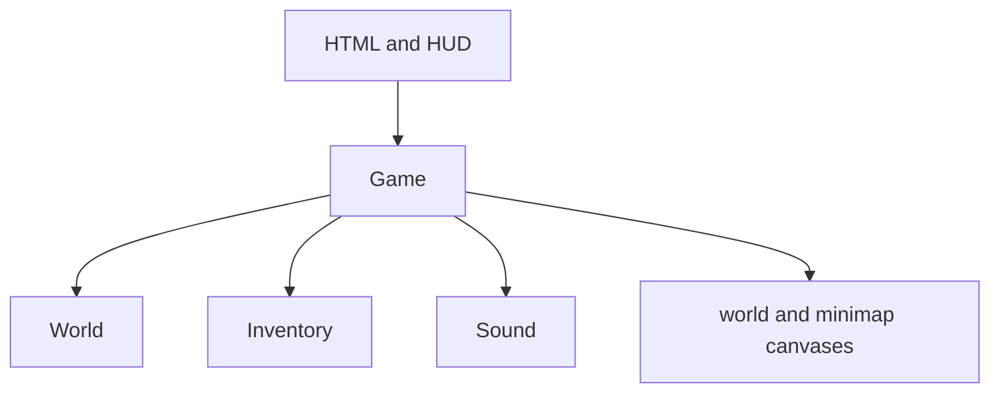

# architecture

This document describes the current browser implementation of **city of nothing**. The project is intentionally dependency-free: the browser loads one stylesheet and one script, then the script owns simulation, UI updates, persistence, audio, and canvas rendering.

## runtime composition



| Component | Responsibility |
| --- | --- |
| `Game` | Runtime state, input, animation loop, movement, collisions, infected, combat, interaction, saves, HUD updates, and all drawing |
| `World` | Deterministic districts, roads, blocks, buildings, trees, interiors, furniture, containers, and loot-table selection |
| `Inventory` | Item ownership, equipment, ammunition, armor totals, consuming items, crafting, filtering, and inventory/crafting markup |
| `Sound` | Lazily created Web Audio context and synthesized one-shot tones |

The final lines of `game.js` construct one `Game` instance. The constructor binds input, sizes the canvases, detects an existing save, initializes the HUD, and starts the `requestAnimationFrame` loop.

## data definitions

The top of `game.js` contains the data-driven content:

- `districts` defines display names, rendering colors, and infected threat multipliers.
- `road_names` supplies deterministic street names.
- `building_names` supplies names for each building type.
- `item_catalog` defines category, equipment slot, ammunition type, numeric statistics, tags, and description.
- `loot_tables` maps a loot context to weighted item-name entries. Repeated names can be used to increase an item's probability.

Runtime items are copies of catalog entries. Each item carries a stable ID, its current statistics, tags, component history, and descriptive fields. Crafted items therefore remain self-contained even if the catalog later changes.

## frame lifecycle

`Game.frame()` clamps the elapsed frame time, advances the simulation only when the run is active and unpaused, renders the current state, and schedules the next frame.

The update phase performs these operations:

1. Advance play time and world time.
2. Update movement, sprinting, stamina, collision, and facing.
3. Generate or retrieve nearby infected and update their behavior.
4. Age transient shot and melee effects.
5. Drain hunger and apply starvation damage.
6. Find the nearest usable door, stair, exit, or container.
7. Smooth the camera toward the player.
8. Continue held-mouse attacks, refresh the HUD when needed, and request a rate-limited save.

Panels pause simulation. Rendering continues while paused so the game remains visible behind inventory, crafting, loot, guide, and death UI.

## deterministic world generation

The world uses a fixed numeric seed and stable hashes derived from grid coordinates and entity IDs.

- The playable city is bounded by `CITY_RADIUS`.
- Each block is `CELL` world units square with a road corridor through its edges.
- District assignment uses distance from the center, coordinate regions, and deterministic noise.
- Building types, names, dimensions, doors, floor counts, basements, and seeds are reproduced from block coordinates.
- Interior geometry, connected room-and-hall templates, furniture, container positions, and loot contexts are reproduced from building seed and floor.
- Outdoor and indoor infected IDs are derived from block, building, floor, and index.
- Container loot is generated from the container ID.

This separates immutable generated state from player-authored deltas. A save does not need to contain the city; it contains facts such as “this container was emptied” or “this infected ID was defeated.”

### stable identity

Generated identities follow readable formats:

| Entity | ID shape |
| --- | --- |
| Building | `building:block_x:block_y:index` |
| Container | `container:building_id:floor:index` |
| Outdoor infected | `infected:out:block_key:index` |
| Indoor infected | `infected:in:building_id:floor:index` |
| Generated loot | `loot:container_id:index` |
| Crafted item | Random UUID-style ID prefixed with `crafted_` |

Changing an ID formula, seed, generation order, or catalog name can change an existing save's relationship to regenerated content. Treat those values as part of the save compatibility contract.

## world and interior caches

Generated data is held in insertion-ordered maps and evicted from the oldest end:

| Cache | Limit | Regeneration behavior |
| --- | ---: | --- |
| Blocks | 180 | Rebuilt deterministically from block coordinates |
| Interiors | 120 | Rebuilt deterministically from building seed and floor |
| Outdoor infected zones | 60 | Rebuilt from block ID, excluding IDs in `killed` |
| Indoor infected zones | No explicit cap | Retained for the active session |

The renderer only visits blocks intersecting the camera bounds. Active outdoor infected are limited to the player's surrounding 3 × 3 block neighborhood.

## movement and collision

Player movement is resolved one axis at a time. Outdoors, circles are checked against nearby rectangular buildings and the city boundary. Indoors, the player is checked against the interior boundary and generated wall rectangles. Every interior template connects its rooms through protected doorways or halls, while entry, exit, and stair clearances are kept free of walls, furniture, and infected spawn points. A blocked position from an older save is relocated to a safe transition point when the save loads.

Infected use similar circle-versus-rectangle checks. When blocked, an infected changes its wander direction rather than running pathfinding. This keeps the simulation inexpensive, but it also means enemies do not calculate routes around complex obstacles.

## combat model

The equipped weapon selects the attack path:

- Melee searches active infected inside a forward arc and damages the nearest valid target.
- Firearms cast one or more mathematical rays against infected circles.
- Shotguns cast five slightly separated rays and apply a fraction of the weapon's attack for each pellet that hits.
- Weapon noise alerts active infected within a derived radius.
- Armor reduces incoming damage, subject to a reduction cap and minimum final damage.

Combat effects such as blood marks, swing arcs, shot lines, camera shake, and synthesized tones are presentation state. They are not persisted.

## rendering pipeline

The main canvas is rendered in CSS-pixel coordinates after applying the current device-pixel ratio:

1. Clear the frame.
2. Apply camera shake, zoom, and world translation.
3. Draw the exterior city or the active interior.
4. Draw blood, infected, transient attack effects, and the player.
5. Restore screen coordinates.
6. Draw the day/night or interior darkness overlay.
7. Draw the mouse crosshair when appropriate.
8. Draw the minimap on its separate canvas.

The device-pixel ratio is capped to control fill rate on high-density displays. The CSS layout has desktop, narrow-screen, and coarse-pointer modes.

## UI contract

At startup, every element with an `id` is collected into the `dom` object. Game code accesses those elements as properties such as `dom.health_meter` and `dom.inventory_grid`.

This makes the HTML IDs a runtime interface:

- Renaming or removing an ID requires updating every matching JavaScript reference.
- Generated item and loot markup escapes runtime text through `safe()` before using `innerHTML`.
- Static buttons bind through `data_*` attributes for close, filter, quick-action, item, and loot behavior.

## persistence

The save key is `city_of_nothing_save_v1`, and the serialized object declares `version: 1`.

| Save field | Meaning |
| --- | --- |
| `player` | Position, facing, health, stamina, hunger, and transient hurt timer |
| `inside` | Building ID, floor, and interior-local position, or `null` |
| `inventory` | Full item records and equipment-slot-to-item-ID mapping |
| `world_minutes` | In-game clock |
| `play_time` | Active-session seconds used for autosave timing and statistics |
| `stats` | Kills, items found, and items crafted |
| `looted` | IDs of fully emptied containers |
| `killed` | Defeated infected IDs; only the most recent 4,000 are serialized |
| `container_items` | Map entries containing generated-but-not-yet-taken loot |

Autosaves are skipped when the game has not started, the player is dead, or fewer than eight active play seconds have passed since the previous non-forced save. Forced saves occur at important state transitions and on `beforeunload`.

Save reads and writes are wrapped in `try`/`catch`. The game remains playable if local storage is unavailable, but progress cannot persist.

## exposed debug surface

The runtime intentionally exposes:

```js
globalThis.city_of_nothing
globalThis.city_of_nothing_test
```

`city_of_nothing` is the live `Game` instance. `city_of_nothing_test` contains `combine_items`, `make_item`, `districts`, `item_catalog`, and `loot_tables` for console inspection or lightweight automated tests.

These globals are developer interfaces, not isolated security boundaries. Do not place secrets in the game or trust browser state as authoritative.
